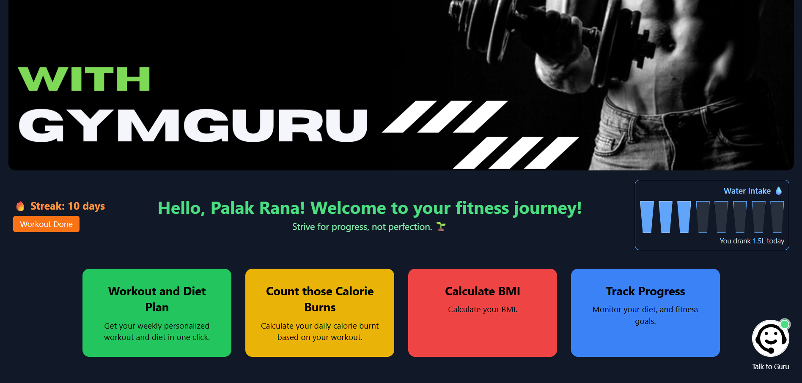

# 🏋️‍♂️ GymGuru - Your AI-Powered Fitness & Nutrition Guide

**GymGuru** is a full-stack AI-based application that generates personalized weekly workout and diet plans. It leverages Google's **Gemini API**, an Express.js backend, and a React.js frontend to deliver intelligent fitness recommendations based on user goals, age, preferred cuisine, and workout time.

 <!-- Replace with an actual image path if available -->

---

## 🚀 Features

- ✅ Personalized workout & diet plans
- ✅ Markdown table rendering
- ✅ Cuisine-based diet customization
- ✅ Age-based nutrition adjustment
- ✅ AI-generated workout guides
- ✅ Responsive modern UI (TailwindCSS)
- ✅ Token-based authentication for secure endpoints
- ✅ BMI Calculator 
- ✅ Intake Tracking
- ✅ Diet Tracking

---

## 🧠 Tech Stack

**Frontend**
- React.js (Vite)
- Tailwind CSS
- React Router

**Backend**
- Node.js & Express.js
- Gemini API integration
- JWT Authentication
  
**Database**
- MongoDB

---

## 📦 Installation 

### 1. Clone the repository
```bash
git clone https://github.com/your-username/gymguru.git
cd gymguru
```

### 2. Set up the backend
```bash
cd backend
npm install
```
### 3. Create a .env file in /backend and add:

```env
GEMINI_API_KEY=your_gemini_api_key_here
JWT_SECRET=your_jwt_secret
```

### 4. Start the backend:

```bash
node index.js
```
or 
```bash
npm start
```
### 5. Set up the frontend
```bash
cd ../frontend
npm install
npm run dev
```
### 🔐 Authentication
GymGuru uses JWT tokens for authentication. The token is saved in localStorage and sent with requests to fetch user-specific data such as age, which is then used to generate diet recommendations.

📄 Example Prompt (used with Gemini API)
```
Create two clearly labeled markdown tables: one for a 1-week workout plan and one for a 1-week diet plan. The diet should follow Indian cuisine for a person of age 25.
```
### 🛠️ Folder Structure
```css
gymguru/
│
├── backend/
│   ├── index.js
│   ├── routes/
│   └── .env
│
├── frontend/
│   ├── src/
│   │   ├── components/
│   │   ├── App.jsx
│   │   └── main.jsx
│   └── public/
│
└── README.md
```

## 🖥️ Project Presentation

📽️ [View the GymGuru Project Presentation (PDF)](docs/GymGuru_Presentation.pdf)

### 🤝 Contributing
Pull requests are welcome! For major changes, please open an issue first to discuss what you would like to change.
```
Fork the repo

Create your feature branch (git checkout -b feature/your-feature)

Commit your changes (git commit -m 'Add your feature')

Push to the branch (git push origin feature/your-feature)

Open a Pull Request
```

📢 License
This project is licensed under the MIT License.

📬 Contact

Built with ❤️ by Palak Rana

Email: palakranag99@gmail.com


